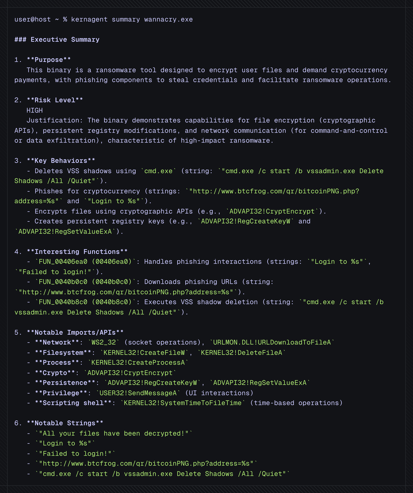
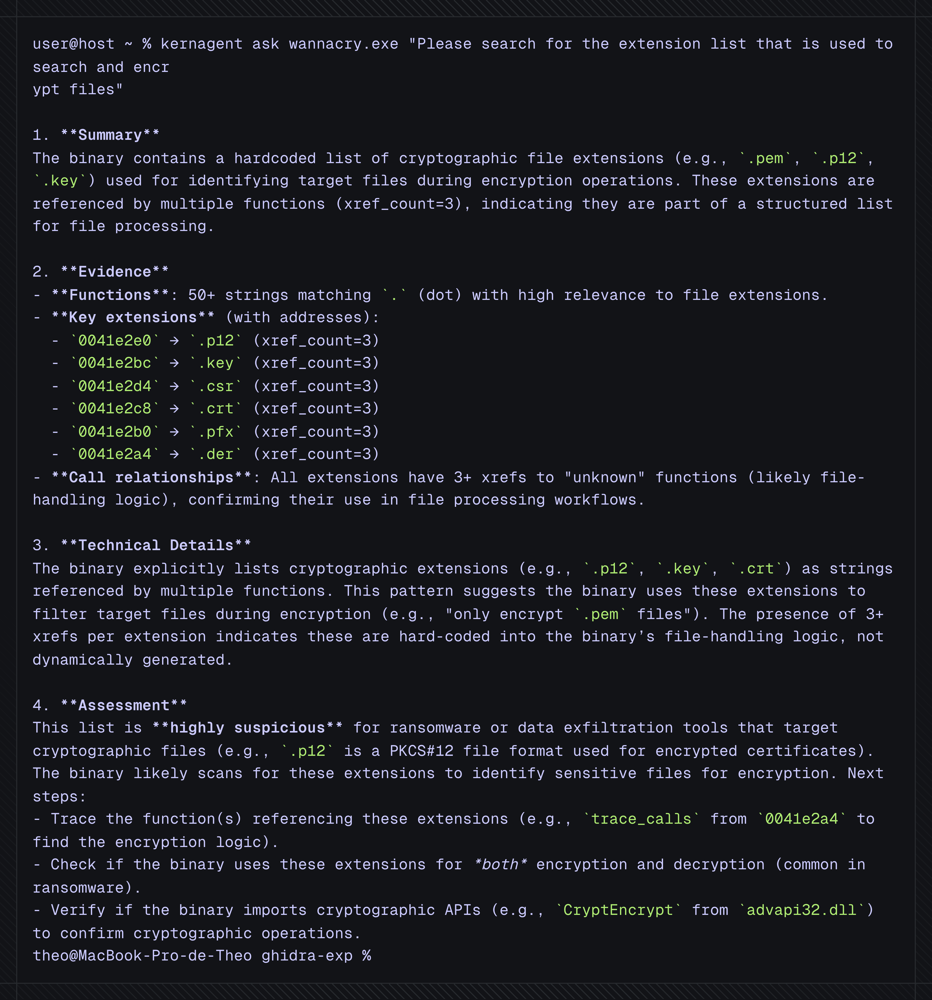

<div align="center">

<pre>
     _                                            _
    | | _____ _ __ _ __   __ _  __ _  ___ _ __ | |_
    | |/ / _ \ '__| '_ \ / _` |/ _` |/ _ \ '_ \| __|
    |   <  __/ |  | | | | (_| | (_| |  __/ | | | |_
    |_|\_\___|_|  |_| |_|\__,_|\__, |\___|_| |_|\__|
                                |___/
</pre>

# 🔍 kernagent

[](https://github.com/Karib0u/kernagent/actions/workflows/ci.yml)
[](https://github.com/Karib0u/kernagent/releases)
[](./LICENSE)
[](https://github.com/Karib0u/kernagent/pkgs/container/kernagent)

**Turn binaries into conversations — deterministic, auditable, offline-capable.**

`kernagent` converts a binary into a **portable static snapshot** and lets an LLM (or your scripts) answer questions **with evidence**.

No live IDE • No GUI automation • No hallucinations

*Offline-capable:* run fully local using an OpenAI-compatible endpoint (e.g., Ollama, LM Studio); no internet required.

</div>

---

## Why kernagent?

* **Headless by design** — runs in CI/Docker; no IDA/Ghidra UI, no MCP required
* **Evidence over vibes** — every answer cites functions, xrefs, imports, strings, and **decompilation snippets**
* **Deterministic & portable** — same binary → same snapshot → same report; easy to diff and archive
* **Model-agnostic** — works with any `/v1/chat/completions` LLM endpoint (OpenAI, Gemini, Ollama, LM Studio, your gateway)

---

## 🚀 Quick start

### Requirements

* Docker (Engine or Desktop) and Git
* 64-bit OS (x86_64 or ARM64)
* 4 GB RAM (8+ GB recommended for large samples)
* Access to an LLM endpoint (internet or a local `/v1/chat/completions` gateway like Ollama or LM Studio)

### Installation

Pick the flow that matches your tooling. All options mount `~/.config/kernagent/config.env` so you configure credentials once.

#### Option 1 — `install.sh` wrapper (Linux / macOS / WSL2)

```bash
bash <(curl -fsSL https://raw.githubusercontent.com/Karib0u/kernagent/main/install.sh)
```

If the one-liner is blocked:

```bash
curl -fsSL https://raw.githubusercontent.com/Karib0u/kernagent/main/install.sh -o install.sh
bash install.sh
```

Or clone first:

```bash
git clone https://github.com/Karib0u/kernagent.git
cd kernagent
bash install.sh
```

The install script does the following (fully auditable in `scripts/`):

1. Checks that Docker is installed and running
2. Pulls the pre-built `ghcr.io/karib0u/kernagent:latest` image from GitHub Container Registry (no build step)
3. Installs these shell scripts to `/usr/local/bin/`:
   - `kernagent` — main CLI wrapper (auto-mounts binaries and config)
   - `kernagent-config` — interactive config editor
   - `kernagent-update` — update to latest/tagged version
   - `kernagent-uninstall` — remove all installed files
4. Saves version info to `~/.config/kernagent/.version`

All scripts are plain shell code you can review in `scripts/` before running. No sudo required unless `/usr/local/bin` is not writable.

##### Advanced — pin install to a tag/commit

To install a specific version of the wrapper and image, point the bootstrapper at a tagged script and pass the tag:

```bash
KERNAGENT_INSTALL_URL="https://raw.githubusercontent.com/Karib0u/kernagent/vX.Y.Z/scripts/install.sh" \
  bash <(curl -fsSL https://raw.githubusercontent.com/Karib0u/kernagent/main/install.sh) --tag vX.Y.Z
```

You can also pin to an exact commit by replacing `vX.Y.Z` with a commit SHA in the raw URL.

#### Option 2 — Docker Compose (Linux / macOS / Windows + Docker Desktop)

```bash
git clone https://github.com/Karib0u/kernagent.git
cd kernagent
mkdir -p ~/.config/kernagent
cp config.env.example ~/.config/kernagent/config.env

# Pull pre-built image (recommended)
docker compose pull

# Or build locally for development
docker compose build

docker compose run --rm kernagent --help
```

Analyze binaries by mounting their directory under `/data`:

```bash
docker compose run --rm \
  -v /absolute/path/to/binaries:/data \
  kernagent summary /data/sample.exe
```

On Windows (PowerShell + Docker Desktop), use Windows-style absolute paths like `C:\malware:/data`.

#### Option 3 — Direct Docker (any OS with Docker)

**Pull pre-built image (recommended):**

```bash
mkdir -p ~/.config/kernagent
curl -fsSL https://raw.githubusercontent.com/Karib0u/kernagent/main/config.env.example \
  -o ~/.config/kernagent/config.env

docker pull ghcr.io/karib0u/kernagent:latest
docker run --rm \
  -v /absolute/path/to/binaries:/data \
  -v ~/.config/kernagent/config.env:/config/config.env:ro \
  ghcr.io/karib0u/kernagent:latest summary /data/sample.exe
```

**Or build locally:**

```bash
git clone https://github.com/Karib0u/kernagent.git
cd kernagent
docker build -t kernagent:local .
docker run --rm \
  -v /absolute/path/to/binaries:/data \
  -v ~/.config/kernagent/config.env:/config/config.env:ro \
  kernagent:local summary /data/sample.exe
```

### Verify install

**Option 1** (wrapper):

```bash
kernagent --help
kernagent --version
```

Run directly:

```bash
kernagent summary /path/to/binary.exe
kernagent ask /path/to/binary.exe "What does this binary do?"
kernagent oneshot /path/to/binary.exe
```

**Options 2 or 3** (Docker Compose / raw Docker):

Verify by running help:

```bash
# Docker Compose
docker compose run --rm kernagent --help

# Raw Docker
docker run --rm ghcr.io/karib0u/kernagent:latest --help
```

### Uninstall

**Option 1** (wrapper):

```bash
kernagent-uninstall
```

**Options 2 or 3** (Docker Compose / raw Docker):

Just delete the clone and remove the images:

```bash
docker image rm ghcr.io/karib0u/kernagent:latest
# or
docker image rm kernagent:local
```

### Update

**Option 1** (wrapper):

```bash
kernagent-update          # switch to latest
kernagent-update --check  # check only
kernagent-update --tag vX.Y.Z  # pin to specific version
```

**Options 2 or 3** (Docker Compose / raw Docker):

Re-run `docker compose pull` or `docker pull ghcr.io/karib0u/kernagent:latest`.

---

## Screenshots

**Summary** — executive overview with cited artifacts


**Ask** — focused Q&A with xrefs/**decompilation** slices


---

## Commands

> **First run** — if no `<name>_archive/` snapshot exists, `kernagent` builds it automatically before answering

### `summary`

Executive overview: purpose, capabilities, key functions/imports/strings, with addresses to verify

```bash
kernagent summary /path/to/binary
# raw JSON (for automation)
kernagent summary /path/to/binary --json
```

### `ask`

Interactive Q&A over the snapshot using safe tools (search functions/strings/imports, follow call graph, read **decompilation**, resolve xrefs)

```bash
kernagent ask /path/to/binary "Show suspected C2 logic and evidence."
```

### `oneshot`

Deterministic triage report for CI/bulk analysis. Classification:
`MALICIOUS | GRAYWARE | BENIGN | UNKNOWN`

```bash
kernagent oneshot /path/to/binary
# raw JSON (for automation)
kernagent oneshot /path/to/binary --json
```

Global overrides (any command):

```bash
# verbosity and per-run model/API overrides
kernagent -v --model gpt-4o \
  --base-url https://api.openai.com/v1 \
  --api-key sk-... \
  summary /path/to/binary
```

---

## How it works (20-second overview)

1. **Extract once** — build a static snapshot with Ghidra/PyGhidra; CAPA rules add capability hints
2. **Read-only tools** — a bounded agent (or your scripts) traverses the snapshot safely
3. **Cited answers** — results always reference concrete artifacts (EAs, names, strings, APIs)

**Snapshot layout (subset)**

```
<name>_archive/
├─ meta.json
├─ functions.jsonl
├─ strings.jsonl
├─ imports_exports.json
├─ callgraph.jsonl
├─ capa_summary.json
└─ decomp/*.c
```

---

## Model configuration

Create once (outside the repo). Fast path:

```bash
kernagent-config
```

Or edit the file manually:

```bash
mkdir -p ~/.config/kernagent
cp config.env.example ~/.config/kernagent/config.env
$EDITOR ~/.config/kernagent/config.env
```

Override via env vars:

```bash
export OPENAI_API_KEY=...
export OPENAI_BASE_URL=https://api.openai.com/v1   # or your gateway
export OPENAI_MODEL=gpt-4o                        # or your local model
```

Any `/v1/chat/completions`-compatible endpoint works.

---

## Comparisons (TL;DR)

* **MCP/IDE plugins** — need a running disassembler and project, often GUI-bound
* **kernagent** — runs headless and emits a portable snapshot you can analyze anywhere, including air-gapped

---

## Design guarantees

* **Read-only**
* **Static-only**
* **Deterministic**
* **Auditable**

---

## Contributing

PRs welcome

---

## License

Apache 2.0 — see [LICENSE](./LICENSE)